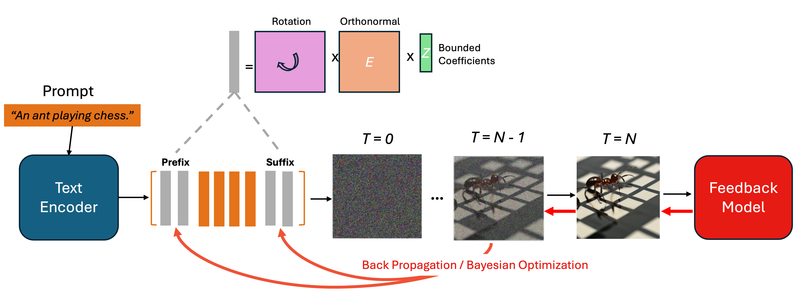

# IPGO: Indirect Prompt Gradient Optimization on Text-to-Image Generative Models with High Data Efficiency

<table class="center">
    <tr>
    <td width=100% style="border: none"></td>
    </tr>
    <tr>
    <td width="100%" style="border: none; text-align: center; word-wrap: break-word">Overview of IPGO Algorithm.
</td>
  </tr>
</table>

## Abstract
Text-to-Image Diffusion models excel at generating images from text prompts but often lack optimal alignment with content semantics, 
aesthetics, and human preferences. To address these issues, in this study we introduce a novel framework, 
Indirect Prompt Gradient Optimization (IPGO), for prompt-level fine-tuning. IPGO enhances prompt embeddings by injecting continuously differentiable tokens at 
the beginning and end of the prompt embeddings, while exploiting low-rank benefits and flexibility from rotations. It allows for gradient-based optimization of 
injected tokens while enforcing value, orthonormality, and conformity constraints, facilitating continuous updates and empowering computational efficiency. 
To evaluate the performance of IPGO, we conduct prompt-wise and prompt-batch training with three reward models targeting image aesthetics, image-text alignment, 
and human preferences under three datasets of different complexity. The results show that IPGO consistently matches or outperforms cutting-edge benchmarks, 
including stable diffusion v1.5 with raw prompts, training-based approaches (DRaFT and DDPO), and training-free methods (DPO-Diffusion, Promptist, and ChatGPT-4o). 
Furthermore, we demonstrate IPGO's effectiveness in enhancing image generation quality while requiring minimal training data and limited computational resources.

## Code (Colab Version)
Currently a Colab-Notebook implementation is available. More compact version will come out soon.

### Running
To run the Colab Notebook, please:

1. Run the first several cells to make sure the environment is updated.
2. Replace the directory placeholders in the "Directories" cell by the desired directories:
   
   (a) **AESTHETIC_MODEL_PATH**: the path for aesthetic scorer model, can be found in asset folder.
   
   (b) **PROMPT_DATA_PATH**: the path for prompt data, txt file.

   (c) **INDIVIDUAL_TRAINING_PATH**: the folder path for saving individual training results.

   (d) **BATCH_TRAINING_PATH**: the folder path for saving batch training results.

### GPU
Current implementation only needs one L4 GPU provided by Colab at most in all possible scenarios. 

More specifically, for Aesthetic training, one T4 GPU is sufficient; for CLIP and Human Preference training, one L4 GPU is required.
